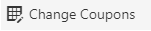
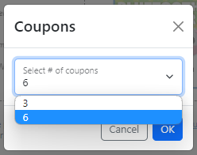
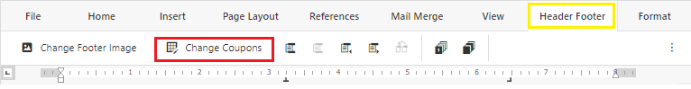

# COUPON

An overview of how to change the number of coupons found in the footer.

<html>
    <video width="640" height="360" controls>
        <source src="../media/Coupon/Coupon_edited.mp4" type="video/mp4">
    </video>
</html>

The Change Coupon feature can be accessed from the Header Footer tab or in the context menu(right-click menu) WHEN the header and footer section is active.

##### From context menu
- Double click on the footer of the page 
- Right-click to show the context menu
- Select **Change Coupons**

- Select the number of coupons from the drop-down menu
>

##### From Header Footer tab
- Double click on the footer of the page 
- Go to the **Header Footer** tab located at the top toolbar
- Click **Change Coupons**
>
- Select the number of coupons from the drop-down menu
>