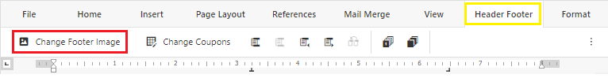

# FOOTER IMAGE

An overview of how to insert or replace the footer with a coupon or static image.

<html>
    <video width="640" height="360" controls>
        <source src="../media/FooterImage/FooterImage_edited.mp4" type="video/mp4">
    </video>
</html>

The Footer Image feature can be accessed from the Header Footer tab or in the context menu(right-click menu) WHEN the header and footer section is active.
>Images are sorted by catergories: *Coupon , Static*
>>*Coupon* are images that will be displayed along side the cut-out coupons
>>>*Static* are images that will display over the entire footer and the cut-out coupons are removed

##### From context menu
- Double click on the footer of the page 
- Right-click to show the context menu
- Select **Change Footer Image**

- Click on the image you want to use

##### From Header Footer tab
- Double click on the footer of the page 
- Go to the **Header Footer** tab located at the top toolbar
- Click **Change Footer Image**
>
- Click on the image you want to use