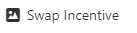
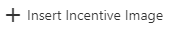
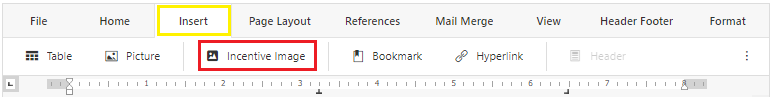

# INCENTIVE

An overview of how to INSERT and SWAP incentive images

## Swap existing incentive image

<html>
    <video width="640" height="360" controls>
        <source src="../media/Incentive/SwapIncentives_edited.mp4" type="video/mp4">
    </video>
</html>

The Swap Incentive feature can be accessed from the context menu(right-click menu) WHEN an existing incentive is selected.

##### To change incentive
- Click on the existing incentive that you want to replace
- Right-click to show the context menu
- Select **Swap Incentive**

- Click on the image you want to use
- Edit the pre-loaded text if needed

## Insert new incentive image

<html>
    <video width="640" height="360" controls>
        <source src="../media/Incentive/InsertIncentives_edited.mp4" type="video/mp4">
    </video>
</html>

The Insert Incentive feature can be accessed from the Insert tab or in the context menu(right-click menu) and will be inserted where the cursor is positioned.

##### From context menu
- Set cursor to the position where you want to insert the incentive
- Right-click to show the context menu
- Select **Insert Incentive Image**

- Click on the image you want to use
- Edit the pre-loaded text if needed

##### From Header Footer tab
- Set cursor to the position where you want to insert the incentive
- Go to the **Insert** tab located at the top toolbar
- Click **Incentive Image**
>
- Click on the image you want use
- Edit the pre-loaded text if needed

>[!Note]
>Inserting a new incentive may shift or alter other sections of the template