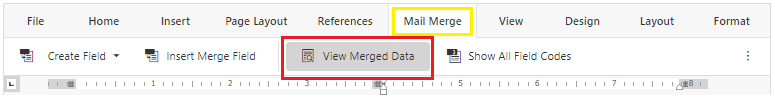
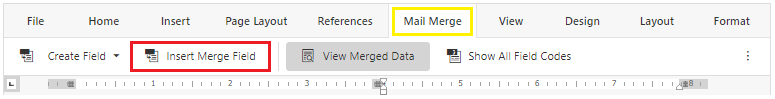

# MAIL MERGE

An overview of the mail merge feature in the parent letter template.

<html>
    <video width="640" height="360" controls>
        <source src="../media/MailMerge/MailMerge_edited.mp4" type="video/mp4">
    </video>
</html>

The merge fields store information from the Fundraiser configuration and populates the data into the parent letter template.

##### To view Merge Field 
- Go to the **Mail Merge** tab located at the top toolbar
- Click the **View Merged Data** to toggle between the merge field name and it's value
>

>[!Tip] 
>Merge fields displayed in the document can be removed by deleting the entire text/name of the field

##### To insert Merge Field
- Place cursor over the area you want to insert the merge field
- Go to the **Mail Merge** tab located at the top toolbar
- Click **Insert Merge Field**
>
- Select from the list of available fields

