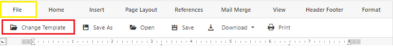

# TEMPLATE

An overview of how to change and save parent letter templates.

## Change Template

<html>
    <video width="640" height="360" controls>
        <source src="../media/Template/ChangeTemplate_edited.mp4" type="video/mp4">
    </video>
</html>

>On initial page load, you will be prompted to select a template.
>>Templates are sortedd by categories : *English Templates, Bilingual Templates, My Templates*.
>>>Any template you save as a new template will appear in *My Templates*.
>>>>At any point, you can change template by following these steps:
         
- Go to the **File** tab located at the top toolbar of the editor
- Click **Change Template**
>
- Select a Template

>[!Warning] 
>Any unsaved changes made to the current working document will be lost when switching to a different template

## Save As New Template

