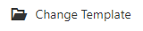

# TEMPLATE

An overview of how to change and save parent letter templates.

## Change Template

<html>
    

        <a style="position:absolute;top:20px;right:1rem;opacity:0.8;" href="../media/ChangeTemplate_edited.mp4"/>
        <iframe autoplay allow="autoplay;" allowfullscreen style="border:none" src="../media/ChangeTemplate_edited.mp4" width="640" height="360"></iframe>
    

On initial page load, you will be prompted to select a template

Templates are sortedd by categories : <i>English Templates, Bilingual Templates, My Templates</i>

Any template you save as a new template will appear in <i>My Templates</i>

At any point, you can change template by following these steps:

    <ul> 
        <li>Go to the <b>File</b> tab located at the top toolbar of the editor</li>
        <li>Click <b>Change Template</b></li>
        
        <li> Select a Template</li>
    </ul>

</html>

>[!Warning] 
>Any unsaved changes made to the current working document will be lost when switching to a different template

## Save As New Template

